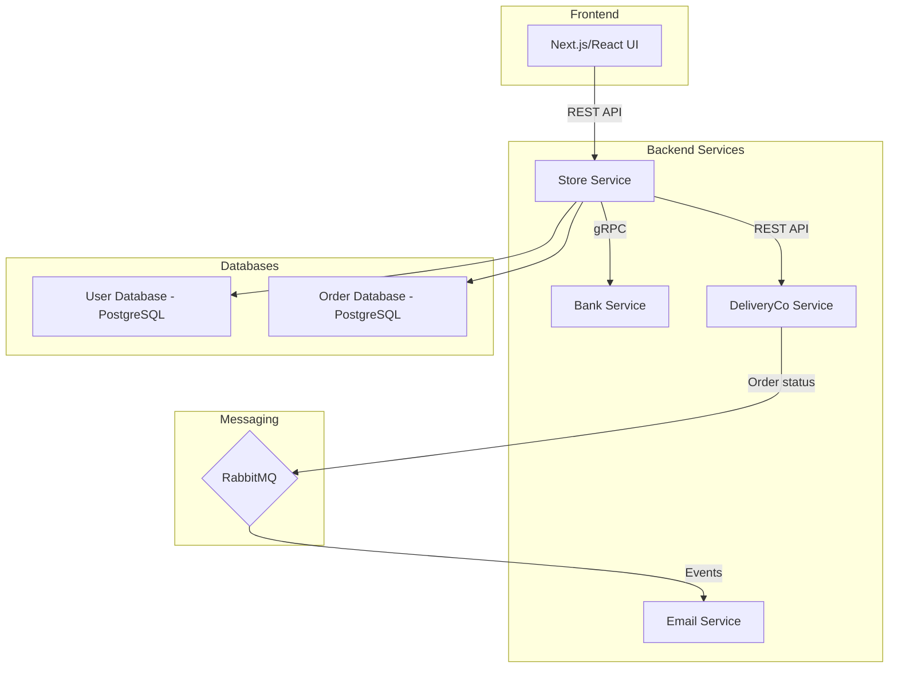
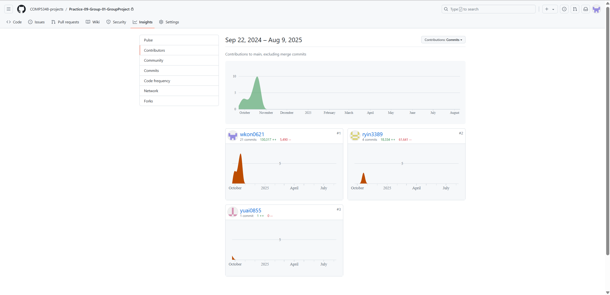
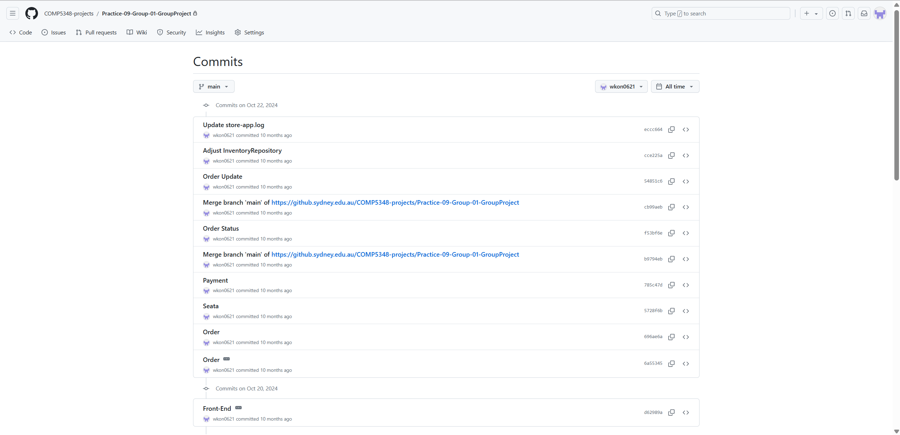
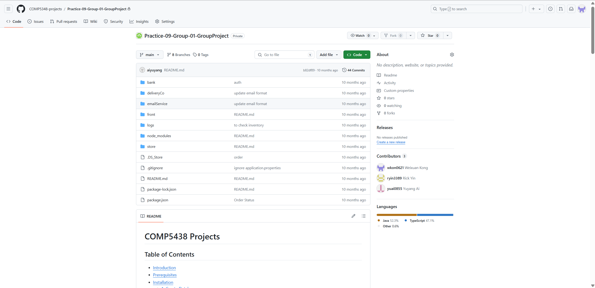

# Showcase: Course Microservice Project for Online Retail

> **Note:** This repository is a public showcase for a private team project completed as part of the COMP5348 course at the University of Sydney. The original repository is hosted on a private university server and is not publicly accessible. This repository preserves the team project source, architecture overview, and historical contribution screenshots. AI-assisted maintenance currently covers documentation; the services have not been rerun for this update.

---

## 1. Project Overview

This course project models an online retail workflow with store, bank, delivery, and email services, alongside a Next.js frontend. The source contains inventory management, payment, order processing, and notification components.

The project explores distributed services, database integration, and inter-service communication. It has not been validated here as a production deployment.

---

## 2. Team Members

This project was a collaborative effort. The team members are:

*   @wkon0621 (Weixuan Kong)
*   @pyin3389 (Rick Yin)
*   @yuai0855 (Yuang Ai)

---

## 3. Architecture & Tech Stack

The repository separates the frontend and four backend services into their own directories and build manifests.

### Architecture Diagram
*(This is a conceptual diagram based on the project structure)*

### Technology Stack

| Category          | Technology / Tool                               |
| ----------------- | ----------------------------------------------- |
| **Backend**       | Java 17, Spring Boot 3.3.x, Gradle             |
| **Frontend**      | Next.js 14, React 18, TypeScript, npm |
| **Database**      | PostgreSQL                                      |
| **Communication** | REST APIs; gRPC in bank/store; RabbitMQ in email/delivery |
| **DevOps**        | Git, GitHub                                     |

---

## 4. Proof of Contribution

The following historical screenshots record team activity and the original project context. They do not establish a complete mapping of individual ownership to the current source files. All screenshots are stored in the `_meta` directory.

### A. Contributor Statistics
*(This image shows the recorded contribution graph from the private repository.)*

### B. Historical Commit History
*(A snapshot of the historical commit log.)*

### C. Project Team Homepage
*(The project's main page on the private university GitHub, showing all team members.)*

